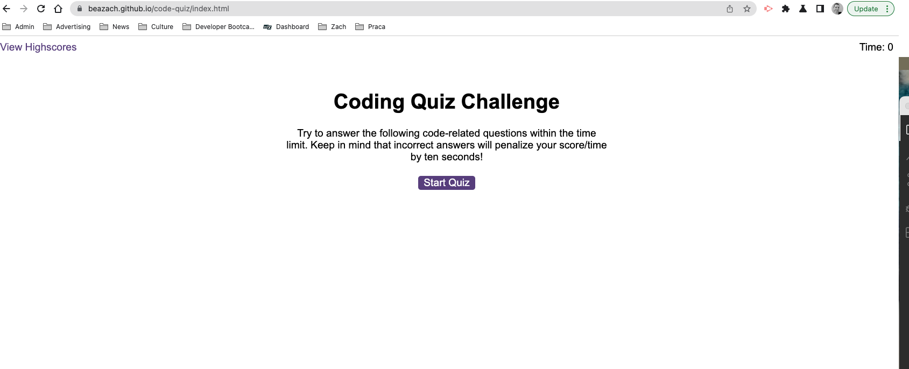
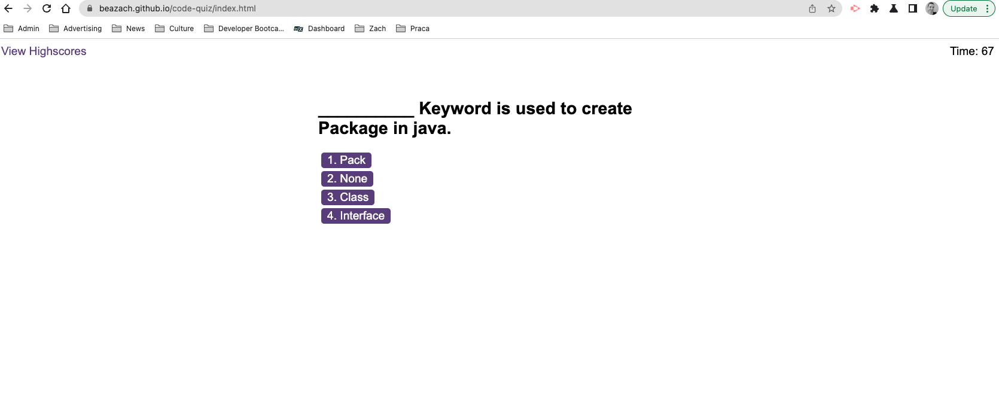
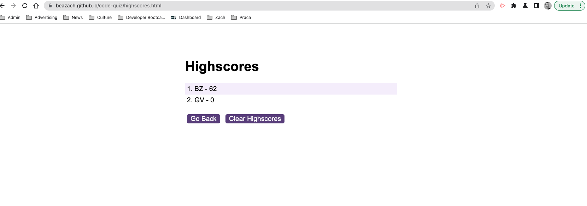
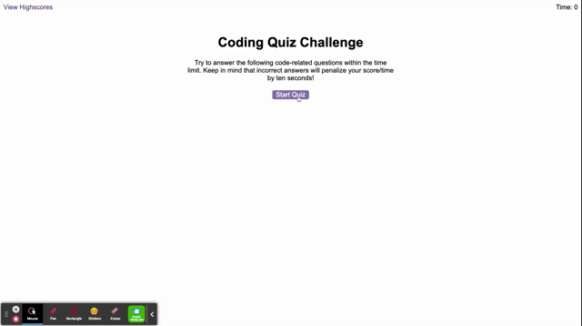

# code-quiz
Deployed link: https://beazach.github.io/code-quiz/

## Description 
In this project I was tasked with creating a timed, multiple-choice coding quiz that can keep track of high scores and quiz-takers' initials. 

### Acceptance Criteria
GIVEN I am taking a code quiz
WHEN I click the start button
THEN a timer starts and I am presented with a question
WHEN I answer a question
THEN I am presented with another question
WHEN I answer a question incorrectly
THEN time is subtracted from the clock
WHEN all questions are answered or the timer reaches 0
THEN the game is over
WHEN the game is over
THEN I can save my initials and score

## Usage
Application appearance - Start Quiz

Questions & Timer:

Scores:

The following animation demonstrates the application funcitonality:

Link:
https://drive.google.com/file/d/1qIWW5CzB3jeqWTx3FZyivij5Mmu2Qps_/preview

## Contact Details
Please leave a note or get in touch about suggestions for code improvements, future projects and collaborations.

## License 
MIT

## Resources 
- https://courses.bootcampspot.com/courses/3029/assignments/46175?module_item_id=853149 (accessed 22 January 2023)
- https://fantastic-pudding.vercel.app/ (accessed 22 January 2023)
- https://www.proprofs.com/quiz-school/quizshow.php?title=pp-untitled-quiz_25620sx&q=5 (accessed 22 January 2023)